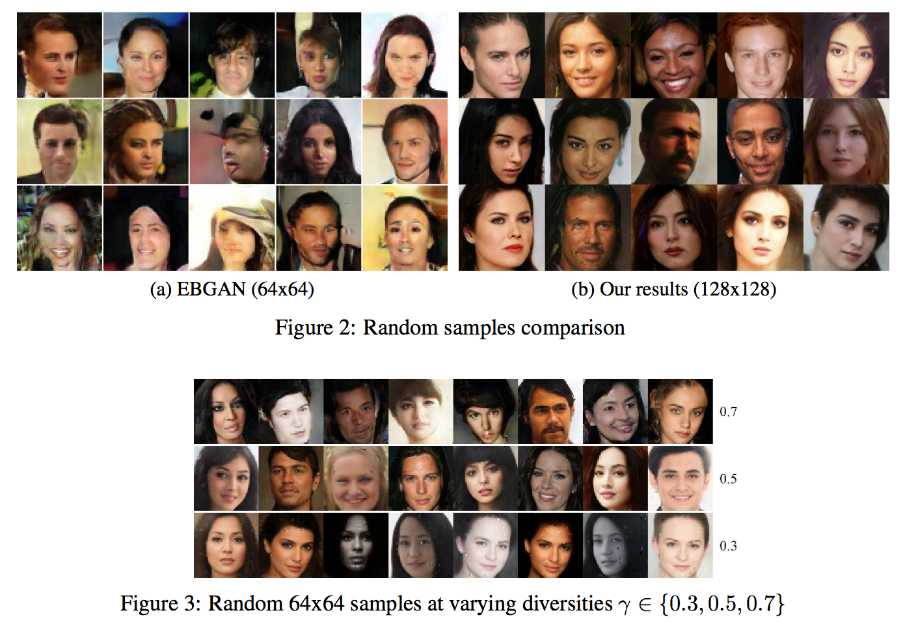
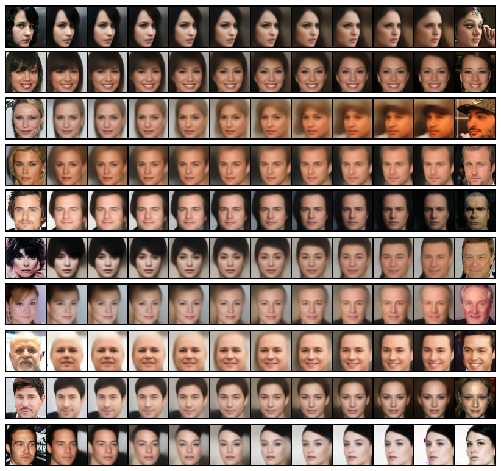

# BEGAN in Tensorflow

Tensorflow implementation of [BEGAN: Boundary Equilibrium Generative Adversarial Networks](https://arxiv.org/abs/1703.10717).

## Requirements

- Python 2.7
- [Pillow](https://pillow.readthedocs.io/en/4.0.x/)
- [tqdm](https://github.com/tqdm/tqdm)
- [requests](https://github.com/kennethreitz/requests) (Only used for downloading CelebA dataset)
- [TensorFlow 1.1.0](https://github.com/tensorflow/tensorflow) (**Need nightly build** which can be found in [here](https://github.com/tensorflow/tensorflow#installation), if not you'll see `ValueError: 'image' must be three-dimensional.`)

## Usage

First download [CelebA](http://mmlab.ie.cuhk.edu.hk/projects/CelebA.html) datasets with:

    $ apt-get install p7zip-full # ubuntu
    $ brew install p7zip # Mac
    $ python download.py

or you can use your own dataset by placing images like:

    data
    └── YOUR_DATASET_NAME
        ├── xxx.jpg (name doesn't matter)
        ├── yyy.jpg
        └── ...

To train a model:

    $ python main.py --dataset=CelebA --use_gpu=True
    $ python main.py --dataset=YOUR_DATASET_NAME --use_gpu=True

To test a model (use your `load_path`):

    $ python main.py --dataset=CelebA --load_path=CelebA_0405_124806 --use_gpu=True --is_train=False --split valid

## Results

### Generator output (64x64) with `gamma=0.5` after 300k steps

### Generator output (128x128) with `gamma=0.5` after 200k steps

### Interpolation of Generator output (64x64) with `gamma=0.5` after 300k steps

### Interpolation of Generator output (128x128) with `gamma=0.5` after 200k steps

    
### Interpolation of Discriminator output of real images
    
   
   
   
   
   
   
   
   
   
   

## Related works

- [DCGAN-tensorflow](https://github.com/carpedm20/DCGAN-tensorflow)
- [DiscoGAN-pytorch](https://github.com/carpedm20/DiscoGAN-pytorch)
- [simulated-unsupervised-tensorflow](https://github.com/carpedm20/simulated-unsupervised-tensorflow)

## Author

Taehoon Kim / [@carpedm20](http://carpedm20.github.io)
