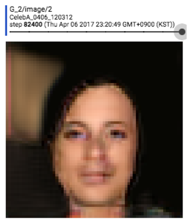
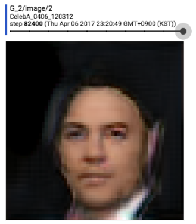
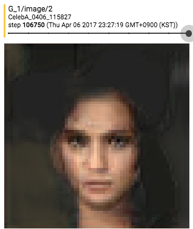
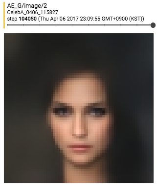
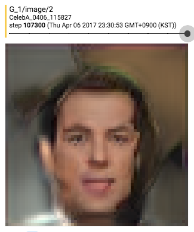
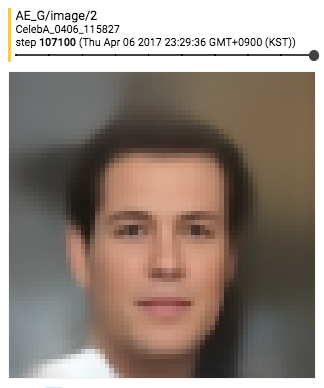
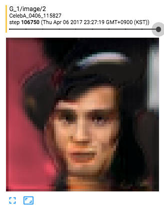
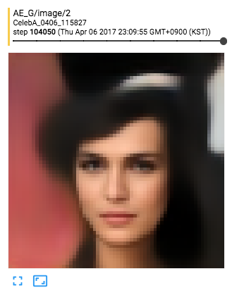

# BEGAN in Tensorflow

Tensorflow implementation of [BEGAN: Boundary Equilibrium Generative Adversarial Networks](https://arxiv.org/abs/1703.10717).

## Requirements

- Python 2.7
- [Pillow](https://pillow.readthedocs.io/en/4.0.x/)
- [tqdm](https://github.com/tqdm/tqdm)
- [TensorFlow 1.1.0](https://github.com/tensorflow/tensorflow) (**Need nightly build** which can be found in [here](https://github.com/tensorflow/tensorflow#installation))
- [requests](https://github.com/kennethreitz/requests) (Only used for downloading CelebA dataset)

## Usage

First download [CelebA](http://mmlab.ie.cuhk.edu.hk/projects/CelebA.html) datasets with:

    $ apt-get install p7zip-full # ubuntu
    $ brew install p7zip # Mac
    $ python download.py

or you can use your own dataset by placing images like:

    data
    └── YOUR_DATASET_NAME
        ├── xxx.jpg (name doesn't matter)
        ├── yyy.jpg
        └── ...

To train a model:

    $ python main.py --dataset=CelebA --use_gpu=True
    $ python main.py --dataset=YOUR_DATASET_NAME --use_gpu=True

To test a model (use your `load_path`):

    $ python main.py --dataset=CelebA --load_path=./logs/CelebA_0405_124806 --use_gpu=True --is_train=False --split valid

## Results

- [BEGAN-tensorflow](https://github.com/carpedm20/began-tensorflow) at least can generate human faces but [BEGAN-pytorch](https://github.com/carpedm20/BEGAN-pytorch) can't.
- Both [BEGAN-tensorflow](https://github.com/carpedm20/began-tensorflow) and [BEGAN-pytorch](https://github.com/carpedm20/BEGAN-pytorch) shows **modal collapses** and I guess this is due to a wrong scheuduling of lr (Paper mentioned that *simply reducing the lr was sufficient to avoid them*).
- Still couldn't reach the quality of paper's result and have some issue [#1](https://github.com/carpedm20/BEGAN-tensorflow/issues/1).

### Generator outputs (after 82400 step)

 

### Generator and Discriminator outputs (after 104000 step)

 

 

 

(in progress)

## Author

Taehoon Kim / [@carpedm20](http://carpedm20.github.io)
